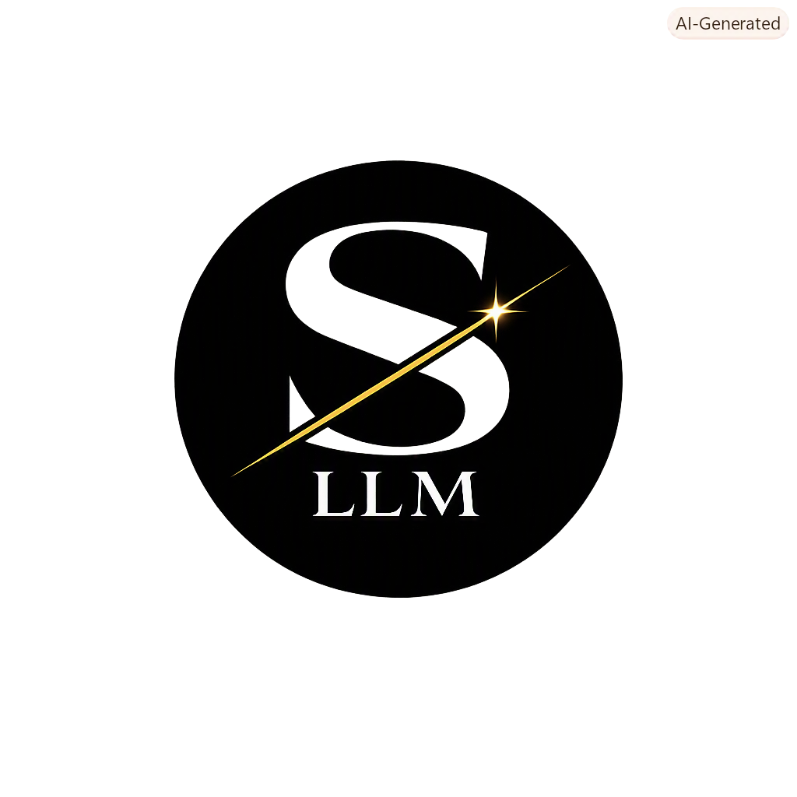
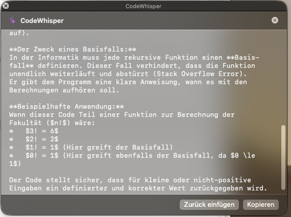

<div align="center">
  

  <h1>ServiceLLM</h1>
</div>

[🇩🇪 Deutsche Version](README.de.md)

**An AI code assistant that lives in the macOS Services menu: any language, any app, local or cloud models.**

Select code, right-click → Services → ServiceLLM: Explain. That's it.

No window to switch to, no paste, no losing your place. It works in Xcode, in
VS Code, in a text editor, in a browser text field, because the Services menu
is part of macOS rather than part of an app.

**Not for you if** you already work inside an editor with an AI assistant
built in. Copilot and Cursor see the surrounding file, which is more context
than a selection carries. This is for the other twenty apps, where there is no
assistant at all.

[](https://github.com/9t29zhmwdh-coder/ServiceLLM/actions) [](https://github.com/9t29zhmwdh-coder/ServiceLLM/security/code-scanning) [](https://securityscorecards.dev/viewer/?uri=github.com/9t29zhmwdh-coder/ServiceLLM) [](https://www.bestpractices.dev/projects/13713)

      

> **How it runs:** ServiceLLM is a native menu-bar app with no Dock icon and no separate background daemon; it lives entirely in the status bar and the macOS Services menu while running.


---

> 💾 **Download:** [macOS (DMG)](https://github.com/9t29zhmwdh-coder/ServiceLLM/releases/latest/download/ServiceLLM.dmg): always the latest release, universal binary for Apple Silicon and Intel, not code-signed/notarized (Gatekeeper will show a warning on first run, right-click → Open). Or build from source, see Build & Install below.

---

ServiceLLM's UI is available in English (default) and German, following your system language automatically; override it anytime in Settings → General.

**In practice:** you select code in any language, in any macOS app (Xcode, VS Code, a text editor, even a browser text field), right-click, choose one of ServiceLLM's actions from the Services submenu (Explain, Refactor, Optimize, Add Comments, Find Bugs, Write Tests, or a Custom prompt you define), and ServiceLLM sends that selection to whichever AI provider you configured in Settings (a cloud model like Claude, or a local model via Ollama/llama.cpp if you want nothing leaving your machine). The response then shows up the way you configured it: a floating popup window, copied to your clipboard, a macOS notification, or pasted directly back over your original selection.



---

> 🌱 New here? → [Step-by-step guide for beginners](GETTING_STARTED.md)

---

## Features

| Preset | What it does |
|---|---|
| **Explain** | Plain-language explanation of the selected code |
| **Refactor** | Improves readability and best practices |
| **Optimize** | Performance-focused rewrite |
| **Add Comments** | Inserts documentation comments |
| **Find Bugs** | Analyses for bugs and edge cases |
| **Write Tests** | Generates unit tests in the framework that fits the language (XCTest, Jest, pytest) |
| **Custom** | Your own system prompt from Settings |

Every preset is language-agnostic: the prompt tells the model to work with whatever language it detects in the selection, so Swift, Python, TypeScript, Go, Rust, SQL, shell and anything else your model knows are all fair game.

### AI Providers

| Provider | Notes |
|---|---|
| Ollama | local, privacy-first, configurable host/port |
| llama.cpp | local, configurable host/port |
| Claude (Anthropic) | cloud, configurable API key |
| OpenAI | cloud, configurable API key |
| Mistral | cloud, configurable API key |

### Local AI or cloud API, your choice

ServiceLLM doesn't pick a side. Point it at a local model (Ollama or llama.cpp) and nothing you select ever leaves your Mac, no API key needed. Or point it at a cloud model (Claude, OpenAI, Mistral) with your own API key for a stronger model at the cost of that selection being sent to that provider. Switch anytime in Settings, per-preset temperature/token limits apply either way.

### Examples

The two examples below happen to be Swift, but nothing in the presets is tied to it.

**Find Bugs**, run on:
```swift
func divide(_ a: Int, _ b: Int) -> Int {
    return a / b
}
```
> Divides without checking for `b == 0`, which crashes with a division-by-zero trap at runtime. Also, `Int` division truncates, silently discarding any fractional result if that wasn't intended. Suggested fix: return an optional or throw, and guard `b != 0` before dividing.

**Explain**, run on:
```swift
let cache = NSCache<NSString, UIImage>()
```
> Creates an in-memory cache mapping string keys to images. Unlike a plain dictionary, `NSCache` automatically evicts entries under memory pressure and is thread-safe, which is why it's the standard choice for image caches instead of a `[String: UIImage]`.

### Output Modes

- **Popup Window**: floating panel with Copy and Paste Back buttons
- **Copy to Clipboard**: silent, plus a brief notification
- **macOS Notification**: Notification Center
- **Paste Back**: replaces the selected text in the editor (requires Accessibility permission)

---

## Requirements

- macOS 14 Sonoma or later
- Apple Silicon or Intel. The released DMG is a universal binary covering both, and `make bundle` builds one too.
- Xcode Command Line Tools (`xcode-select --install`)
- Swift 5.9+

---

## Build & Install

```bash
git clone https://github.com/9t29zhmwdh-coder/ServiceLLM
cd ServiceLLM
make install
```

`make install` compiles, assembles the `.app` bundle, copies it to `/Applications/`, and flushes the NSServices cache.

---

## First Launch

1. Open `/Applications/ServiceLLM.app`; a `</>` icon appears in the menu bar.
2. Click it → **Settings** → choose your provider and enter the API key.
3. Restart the menu bar app once (Quit → reopen) to activate the Services entries.
4. In Xcode (or any editor): select code → right-click → **Services** → **ServiceLLM: Explain**.

> **Paste Back** requires *Accessibility* permission:  
> System Settings → Privacy & Security → Accessibility → enable ServiceLLM.

---

## Uninstall / Cleanup

- Delete `/Applications/ServiceLLM.app`
- Remove stored settings: `defaults delete com.9t29zhmwdh.ServiceLLM`
- Remove stored API keys from Keychain Access.app (search for "claudeAPIKey", "openAIAPIKey", "mistralAPIKey")
- Quit ServiceLLM first (or restart) so the NSServices entries disappear from the right-click Services menu

No other files or background services are left behind.

> **Upgrading from 1.x (CodeWhisper):** the app was renamed in 2.0.0 and its bundle identifier changed from `com.9t29zhmwdh.CodeWhisper` to `com.9t29zhmwdh.ServiceLLM`. Your API key lives in the Keychain under the old identifier, so enter it once more in Settings after the upgrade. Then delete the old `/Applications/CodeWhisper.app` and run `defaults delete com.9t29zhmwdh.CodeWhisper` to clear its leftover settings.

---

## Architecture

```
Sources/ServiceLLM/
├── LLM/               # Provider protocol + Ollama / llama.cpp / any OpenAI-compatible API
├── PromptEngine/      # Presets and prompt builder
├── ResponseFormatter/ # Markdown trim, code block extraction
├── OutputEngine/      # Popup, clipboard, notification, paste-back
├── Settings/          # Keychain, model, UserDefaults persistence
├── Localization/      # L10n: EN/DE strings, system-language detection + manual override
├── UI/                # NSPanel popup, status bar menu
├── AppDelegate.swift  # 7 NSServices selectors → shared pipeline
└── main.swift         # .accessory activation policy
```

---

## Project Structure

```
ServiceLLM/
├── Package.swift
├── Info.plist         # NSServices registration (7 entries), LSUIElement = true
├── Makefile           # build / bundle / install / clean
└── Sources/ServiceLLM/
```

---

**Author:** [Rafael Yilmaz](https://github.com/9t29zhmwdh-coder) · **Status:** Active ·  · **License:** MIT
